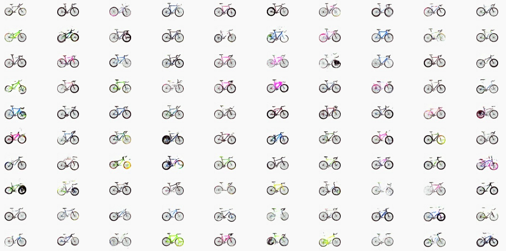

# Deep Convolutional Generative Adversarial Network (DCGAN)
This is an implementation of DCGAN in python. 

## Requirements

* Python >= 3.7
* Tensorflow >= 2.6
* CUDA Toolkit
* GPU

# The tutorial 📃

On Medium:

https://azad-wolf.medium.com/latent-spaces-part-3-a-practical-introduction-to-deep-convolutional-generative-adversarial-8c6169bbf9b0

On substack:

https://azadwolf.substack.com/p/a-practical-introduction-to-deep

# References 🔗

http://decode.mit.edu/projects/biked/  \
https://arxiv.org/abs/2103.05844 \
https://arxiv.org/abs/2010.11694  \
https://arxiv.org/abs/1406.2661

